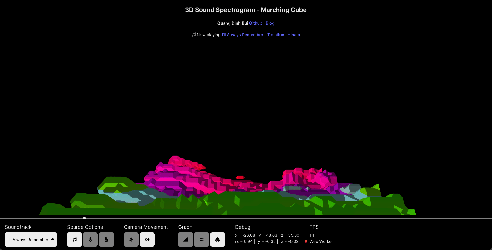
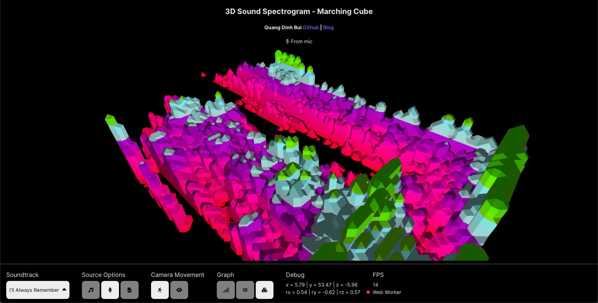
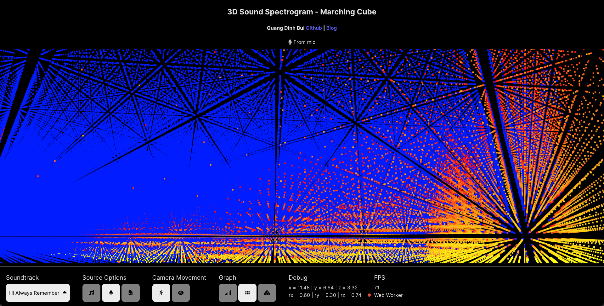
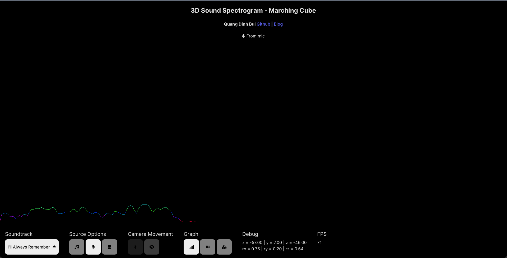
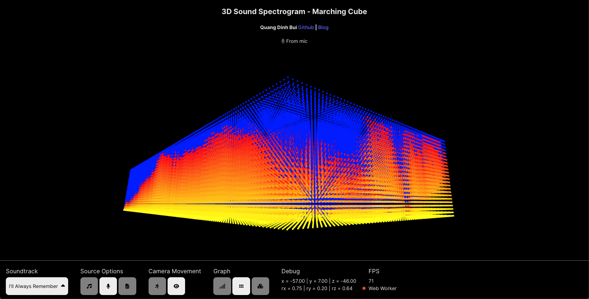
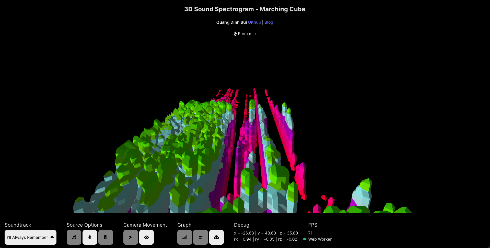

# 3D Sound Spectrogram - Marching Cube
## Context
The original idea wasn't making a sound spectrogram. I was looking for some sound spectrogram libraries to use in one of my personal projects, but found a lot of them are not what I wanted. Until I hit this project on Chrome Experiment: It's [here](https://musiclab.chromeexperiments.com/spectrogram/). It is an amazing work and I'm totally blown away by how beautiful it is. So I changed course, I wanted to make something like this. However, I didn't want to make the exact same thing, I want something a bit different. So Marching Cubes! I experienced with Marching Cubes in Unity before, so I know how to do it. Here is my little experiment.

## Demo
You can play with it [here](https://qdinh.me/). More information is on my webiste [here](https://qdinh.me/). You can use your microphone, use my selected soundtracks and your own.

## Previews

